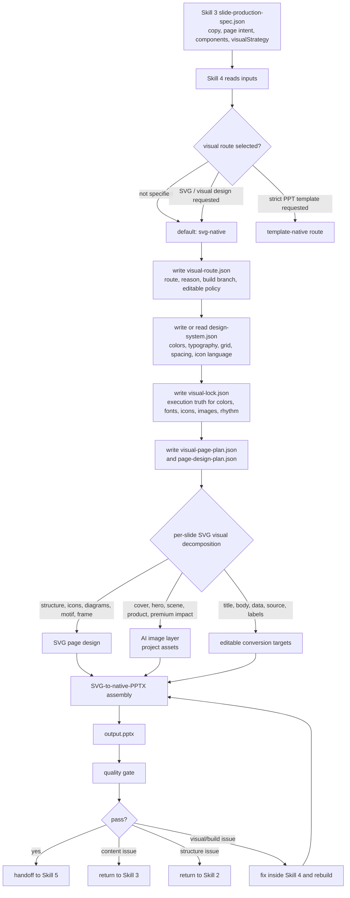

# SVG-Native Route

`svg-native` is the default Skill 4 route for new decks that need stronger design quality than a fixed template can provide.

The route designs pages with SVG first, then converts/assembles the SVG pages into editable native PPTX objects wherever the toolchain supports it. It is not a whole-slide PNG route.

## Goal

Create a PPTX that feels deliberately designed page by page while remaining practical to edit.

The route combines:

- SVG pages for the main page composition.
- SVG-to-native-PPTX conversion/assembly for editable text, shapes, lines, cards, icons, and diagrams wherever technically possible.
- AI-generated images for cover, hero, scene, product, lifestyle, or high-impact visual moments.
- Whole-slide bitmap output only as an explicit preview artifact, never as the default final PPTX.

## End-to-End Flow



## Route Contract

Write the route decision to:

```text
projects/<deck-slug>/04-design/visual-route.json
```

Minimum structure:

```json
{
  "version": "0.1",
  "route": "svg-native",
  "reason": "The deck needs page-by-page SVG visual design and editable native PPTX output rather than a fixed template.",
  "buildBranch": {
    "primary": "svg-page-design-to-native-pptx",
    "finalPptxMustBeEditable": true,
    "wholeSlideBitmapAllowed": false
  },
  "editablePolicy": {
    "criticalText": "ppt-native",
    "numbersAndSources": "ppt-native",
    "decorativeMicroText": "svg-allowed",
    "charts": "ppt-native-or-source-aware-svg"
  },
  "imagePolicy": {
    "role": "selective-support",
    "allowedUses": ["cover", "hero", "scene", "product", "lifestyle", "visual-reset"],
    "forbiddenUses": ["decorative filler", "fake evidence", "fake UI", "dense text"]
  }
}
```

## Page Design Plan

Write the page-level editable design plan to:

```text
projects/<deck-slug>/04-design/page-design-plan.json
```

Each slide must define:

```json
{
  "slideNumber": 1,
  "pageType": "cover",
  "pageRhythm": "anchor",
  "visualIntent": "Make the opening feel like a premium event poster.",
  "pageRole": "first impression and promise",
  "composition": "svg-typographic-cover",
  "imageRole": "none",
  "editableRole": "title, subtitle, speaker, date",
  "composition": {
    "grid": "12-column",
    "safeArea": "title stays in left 60%; metadata stays bottom left",
    "density": "low",
    "dominantElement": "large typographic title"
  },
  "layering": {
    "svg": "main surface",
    "nativePptx": "final editable conversion target",
    "image": "supporting asset when used"
  },
  "nativeObjects": [
    "background color field",
    "subtle dot matrix made from editable text/shapes",
    "thin rule line",
    "accent blocks",
    "main title",
    "subtitle",
    "speaker/date"
  ],
  "imageAssets": [],
  "pptNativeElements": [
    "main title",
    "subtitle",
    "speaker/date",
    "source note if needed"
  ],
  "qualityRules": [
    "cover title may wrap by design; body titles must not wrap",
    "do not place critical text inside generated images",
    "no image stretching"
  ]
}
```

Deck-level `page-design-plan.json` should use this shape:

```json
{
  "version": "0.1",
  "route": "svg-native",
  "editableFirst": true,
  "deckRhythm": {
    "pattern": ["anchor", "dense", "breathing"],
    "maxSameRhythmInRow": 2,
    "sectionResetEvery": "3-5 slides when useful"
  },
  "slides": []
}
```

## Visual Decomposition Rules

Before rendering each page, decompose the page into three jobs:

| Question | If yes | Layer |
|---|---|---|
| Does the page need structure, relationship, categories, steps, icons, maps, or a branded graphic language? | Build it with editable PPT-native objects first. | PPT-native |
| Does the page need realism, emotion, product feel, lifestyle context, or a strong first impression? | Use AI-generated image or real asset. | Image |
| Does the content need to stay editable, factual, sourceable, or frequently updated? | Keep it as PPT-native text/data. | PPT-native |

Default split:

- Cover: SVG typography/background first; image only when it has a meaningful scene or product role.
- Concept page: SVG icons/diagram + PPT-native title/body.
- Process page: SVG or Mermaid/PPT-native diagram + editable labels.
- Case/demo page: image or screenshot + SVG frame + editable explanation.
- KPI/data page: PPT-native numbers/charts + SVG visual frame.
- Closing: SVG background/typography + editable action/Q&A text.

## Page Execution Order

For each slide:

1. Read the slide spec and `visual-page-plan`.
2. Re-read `visual-lock.json`.
3. Lock page rhythm: `anchor`, `dense`, or `breathing`.
4. Check the title and body capacity. If the body-page title will wrap, stop and route back to Skill 3 or rewrite only if the user has allowed Skill 4 to shorten titles.
5. Design the editable composition first: background, grid, shape language, icon system, diagram skeleton, card frames, decorative motifs.
6. Decide whether an AI image is still needed. If yes, use the approved prompt and crop/slot rules. If no, do not generate one.
7. Place PPT-native editable text/data over or beside the visual layer.
8. Assemble the slide with PPTGenJS using editable objects.
9. Use local SVG components only for complex non-critical visual fragments.
10. Run layout safety checks before moving to the next slide.

Do not batch-design every page with one generic skeleton. The route is page-by-page, but constrained by one deck-level design system.

## Local SVG Responsibilities

Local SVG is allowed for:

- complex background motifs that are not critical content
- icon systems and pictograms when native drawing is insufficient
- diagrams, route maps, loops, relationship graphs, visual metaphors as local components
- card accents, KPI accents, comparison structures, callout decoration
- playful or branded decorative systems
- page rhythm variation when the deck would otherwise look repetitive
- simple background systems that make one deck feel coherent without forcing every slide into the same template

SVG must not own:

- long body copy
- essential titles
- source notes
- editable numbers
- chart data that needs future updates
- QR codes or compliance-sensitive labels
- the whole slide

### SVG Element Rules

- Use SVG for shapes, icons, lines, patterns, diagrams, and decorative micro-typography.
- Keep SVG dimensions stable at 16:9 and align with the PPT slide coordinate system.
- Avoid embedding external network resources in SVG.
- Avoid visible essential text inside SVG unless it is decorative or duplicated/editable in PPT-native text.
- Use consistent icon stroke width, corner radius, and color tokens across the deck.
- Do not create one-off visual gimmicks that break the deck's design system.

## AI Image Responsibilities

AI images are preferred for:

- cover mood when a realistic or artistic scene helps
- product/lifestyle hero imagery
- event atmosphere
- classroom/store/user scenario
- visual demonstrations where realism matters
- attention reset pages

AI images should not be used for:

- content that must be factual evidence
- fake product screenshots
- fake official materials
- dense diagrams, prompt text, checklists, or data tables
- filling empty space without a message

### Image Prompt Rules

When an image is needed, Skill 4 must preserve the prompt intent from Skill 3 and may only refine for slot fit and visual consistency.

Every generated image entry must include:

- purpose
- subject
- scene
- composition
- aspect ratio
- safe area
- style
- color palette
- must include
- must avoid
- relationship to slide text

If these fields are missing, return to Skill 3 instead of inventing a random image.

## Fusion Rules

SVG and AI image must feel like one page:

- Use the same accent palette and contrast level.
- Crop images to the slot; never stretch.
- Keep image subject inside the safe area.
- Use SVG frames, masks, or rules to integrate the image into the page.
- Do not put text-heavy SVG overlays on busy images.
- If an image dominates the page, reduce other decorative elements.

## Required Artifacts

For a complete `svg-native` build, create or update:

```text
projects/<deck-slug>/
├── 04-design/visual-route.json
├── 04-design/design-system.json
├── 04-design/visual-lock.json
├── 04-design/visual-page-plan.json
├── 04-design/page-design-plan.json
├── 04-design/asset-plan.json
├── 05-build/svg-pages/
│   ├── slide-01.svg
│   ├── slide-02.svg
│   └── ...
├── 05-build/svg-native-output.pptx
├── 05-build/deck-builder-input.json
├── 05-build/output.pptx
└── 06-review/
    ├── pptx-quality-report.json
    └── svg-quality-report.json
```

If a slide uses a generated image, also copy the image into:

```text
projects/<deck-slug>/assets/
```

Do not reference platform cache paths directly from the PPTX build input.

## Template Branch Relationship

The `template-native` branch remains available for:

- strict company templates
- template-following from a provided PPTX
- fast deterministic builds
- decks where editability matters more than bespoke visual design

The `svg-native` route may still reuse template tokens, typography rules, and component packs as constraints. It should not be forced into registered body layouts when a page-specific SVG composition is the better solution.

## Quality Gate

Reject or revise a slide when:

- the title wraps on a body page
- text overlaps SVG or images
- critical content is trapped inside a non-editable image
- generated images are unrelated to the slide message
- more than three consecutive slides have the same rhythm
- the SVG layer looks decorative but does not organize meaning
- the visual route silently falls back to a generic template without reporting it

Deck-level checks:

- The deck has a visible rhythm plan, not the same page skeleton repeated.
- SVG and image styles share a palette and composition logic.
- Generated images are used selectively and meaningfully.
- Critical content remains editable.
- Body-page titles do not wrap.
- Photos and generated images are cropped or contained proportionally.
- At least one of every 3-5 slides changes rhythm when the deck is longer than 10 slides.

## Failure Handling

When something fails, use this ownership rule:

| Problem | Owner |
|---|---|
| wrong audience, purpose, scenario | Skill 1 |
| wrong slide order, missing chapter, weak structure | Skill 2 |
| title too long, body too verbose, image prompt missing, component content missing | Skill 3 |
| SVG too decorative, image unrelated, layout overlap, title wrapping caused by renderer, bad fusion | Skill 4 |
| generated PPTX fails final review after build | Skill 5 loops back to Skill 4 before Skill 6 |

Skill 4 should repair Skill 4 defects directly. It should not pass known visual defects forward as a report only.
