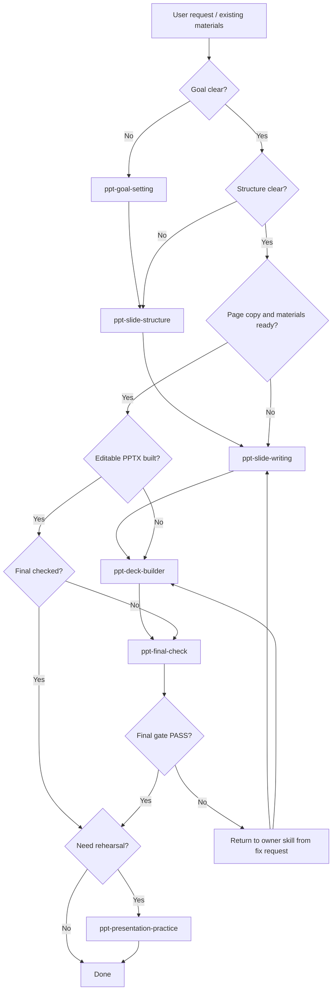

# PPT-Maker

Use this skill as the top-level router for the PPT workflow.

This skill does not replace the six specialized PPT skills. It decides where the user is in the workflow, calls the right skill, and keeps the handoff artifacts consistent.

## Six-Skill Workflow

Run the full workflow in this order:

```text
ppt-goal-setting
-> ppt-slide-structure
-> ppt-slide-writing
-> ppt-deck-builder
-> ppt-final-check
-> ppt-presentation-practice
```

| Step | Skill | Core job | Main output |
|---:|---|---|---|
| 1 | `ppt-goal-setting` | Clarify what PPT to make, for whom, in what scenario, and with what constraints | `PPT Project Brief v1: Goal Diagnosis` |
| 2 | `ppt-slide-structure` | Choose suitable structure/framework and define chapters, page sequence, timing, and each page's core message | `PPT Project Brief v2: Slide Structure` |
| 3 | `ppt-slide-writing` | Produce page-by-page final copy, material/data needs, image/chart descriptions, layout specs, and component specs | `PPT Project Brief v3: Slide Spec` |
| 4 | `ppt-deck-builder` | Build editable PPTX with visual system, layout, typography, assets, playback/animation settings, and QA | `PPT Project Brief v4: Built Deck` |
| 5 | `ppt-final-check` | Act as the final quality gate: check logic, copy, data/source, visuals, compliance, score, and generate fix requests until PASS | `PPT Project Brief v5: Final Gate Report` |
| 6 | `ppt-presentation-practice` | After v5 PASS, prepare live delivery: speaking strategy, timing, speaker cards, Q&A, pressure questions, and emergency talking points | `PPT Presentation Practice Report` |

## Entry Router

Start from the earliest missing or weak step.

| User situation | Start with |
|---|---|
| User only has a vague idea or topic | `ppt-goal-setting` |
| Goal/audience/scenario are clear, but no structure exists | `ppt-slide-structure` |
| Structure exists, but slide copy/material/data descriptions are missing or weak | `ppt-slide-writing` |
| Page-by-page content is approved and user wants an editable PPTX | `ppt-deck-builder` |
| PPTX and delivery package exist and user wants final review/check | `ppt-final-check` |
| PPT has v5 PASS and user wants to rehearse or prepare Q&A | `ppt-presentation-practice` |
| PPT has v5 FAIL or unresolved Major/Blocker issues | Return to owner skill from `ppt-final-check` fix request |
| User has an existing PPT and asks to improve it | Diagnose first: content issue -> Step 1/2/3; visual/file issue -> Step 4; final QA -> Step 5; rehearsal -> Step 6 |

If the user asks for a specific skill or step, use that step directly. Do not force the full workflow.

## Confirmation Policy

Default to `standard` mode unless the user asks for speed, deep review, or step-by-step control.

| Mode | Best for | Confirmation gates |
|---|---|---|
| `fast` | quick first draft, exploratory deck | Step 1, Step 5 |
| `standard` | most formal PPT work | Step 1, Step 2, Step 5 |
| `deep` | launch, leadership report, courseware, high-stakes presentation | Step 1, Step 2, Step 3 sample pages, Step 5, optional Step 6 |

Gate behavior:

- Step 1 confirmation is required because goal/audience/scenario errors contaminate the whole workflow.
- Step 2 confirmation is required in `standard` and `deep` modes because structure, slide count, timing, and page sequence determine the rest of the deck.
- Step 3 does not require full-deck confirmation by default. In `deep` mode, show only the first 3-5 representative page specs for language, layout intent, and visual strategy confirmation.
- Step 4 should run automatically after Step 3 when the handoff is complete. Do not ask for confirmation before building unless the user requested manual control or expensive external generation.
- Step 5 should run automatically after Step 4 as the delivery gate. If Step 5 finds `FAIL` or `CONDITIONAL_PASS`, route back to the owner skill and recheck after fixes instead of asking the user to manage the loop.
- Step 6 is optional. Offer it only after Step 5 is `PASS` or after the user explicitly asks for rehearsal, speaker notes, Q&A, or live presentation practice.

Do not ask for approval at every step. Ask only at the selected mode's confirmation gates or when missing information materially changes the result.

## Handoff Artifacts

Keep artifacts named consistently:

```text
PPT Project Brief v1: Goal Diagnosis
PPT Project Brief v2: Slide Structure
PPT Project Brief v3: Slide Spec
PPT Project Brief v4: Built Deck
PPT Project Brief v5: Final Gate Report
PPT Presentation Practice Report
```

When moving to the next skill, pass forward the relevant prior artifacts instead of asking the user to restate information.

For source-heavy, long, or rebuildable decks, use the project folder standard from `../../references/project-structure.md`.

Recommended project artifacts:

```text
projects/<deck-slug>/
├── 00-intake/
├── 01-research/
├── 02-structure/
├── 03-production/
├── 04-design/
├── 05-build/
├── 06-review/
└── 07-practice/
```

Protocol references:

- `../../references/v2-architecture.md` defines the V2 artifact flow.
- `../../references/source-intake.md` defines source package and citation handling.
- `../../references/research-brief.md` defines the research brief.
- `../../references/visual-component-registry.md` defines components, icons, charts, and Mermaid usage.
- `../../references/template-system-v2.md` defines theme/layout/component/template layering.
- `../../references/slide-spec.md` defines the Skill 3 to Skill 4 contract.
- `../../references/layout-registry.md` defines stable layout IDs.
- `../../references/theme-tokens.md` defines theme token expectations.
- `../../references/skill6-presentation-practice.md` defines project-level rehearsal output after v5 PASS.

Expected final delivery package after Step 4:

```text
ppt-delivery-package/
├── deck.pptx
├── project-brief-v4.md
├── deck-builder-input.json
├── asset-log.json
├── asset-manifest.json
├── design-lock.json
└── pptx-quality-report.json
```

Optional preview artifacts are generated only when the user explicitly asks for screenshots, preview images, PDF export, or rendered visual verification:

```text
ppt-delivery-package/
├── contact-sheet.png
└── slide-previews/
```

Step 5 depends on the delivery package. If previews are missing, Step 5 can still check content/source logic and source-level layout rules. It should mark rendered visual QA as incomplete only when the user requested rendered visual verification or the delivery scenario requires it.

Step 6 depends on v5 PASS. If v5 is FAIL, route back to the owner skill in the fix request. If v5 is CONDITIONAL_PASS, ask whether the user accepts the remaining risks before formal rehearsal.

In project mode, Step 6 can be generated with:

```bash
cd tools/ppt-builder-cli
npx tsx src/cli.ts practice-project <project-dir> --out
```

This writes `07-practice/practice-report.md` and optional scripts under `07-practice/`.

## Responsibility Boundaries

Use this ownership model when diagnosing problems:

- `ppt-goal-setting`: purpose, scenario, target audience, delivery time, role, or success criteria.
- `ppt-slide-structure`: narrative route, chapter logic, page sequence, slide count logic, page core messages.
- `ppt-slide-writing`: final slide copy, slide-spec contract, page content, examples, data/source needs, material plan, component specs, image/chart descriptions.
- `ppt-deck-builder`: editable PPTX generation, visual system, layout registry mapping, theme tokens, chart rendering, image generation/placement, playback/manual advance, animation settings, optional previews.
- `ppt-final-check`: final delivery gate, PASS/FAIL/CONDITIONAL_PASS, issue list, fix request, recheck requirement.
- `ppt-presentation-practice`: only after PASS; speaking strategy, timing, speaker cards, simulated questions, pressure Q&A, emergency responses.

Do not solve upstream problems in downstream skills by hiding them. Route them back to the correct owner.

## Fast Paths

Use fast paths when the user wants speed.

- Fast from topic to draft: `ppt-goal-setting -> ppt-slide-structure -> ppt-slide-writing`
- Fast from approved content to PPTX: `ppt-deck-builder`
- Fast from PPTX to delivery decision: `ppt-final-check`
- Fast from ready deck to rehearsal: `ppt-presentation-practice`

For simple one-off requests, use only the relevant skill.

## Operating Rules

1. Treat this as a set of skills, not a standalone app.
2. Ask only for missing information that materially changes the next output.
3. Use uploaded files and prior artifacts before asking the user to repeat context.
4. Keep the user in control at selected gates from the confirmation policy. Default `standard` gates are Step 1, Step 2, and Step 5.
5. Prefer editable PPTX output over image-only slides.
6. Preserve source and asset provenance across steps.
7. If a generated PPT looks weak because content is weak, route back to `ppt-slide-writing` or `ppt-slide-structure`.
8. If the deck cannot pass final check, do not proceed to presentation practice. Return to the owner skill, fix, rebuild if needed, and rerun `ppt-final-check`.
9. In `standard` mode, automatically continue from Step 3 to Step 4 to Step 5 when required artifacts are complete.

## Full Workflow Flowchart



## Output Style

When routing, state:

- current detected step
- why that step is the right entry point
- which skill will be used
- required input or artifact
- expected output

For a full workflow, briefly show the current stage and next stage after each major output.

At confirmation gates, keep the prompt short and action-oriented. For non-gate handoffs, state that the workflow is continuing automatically and name the next skill.
